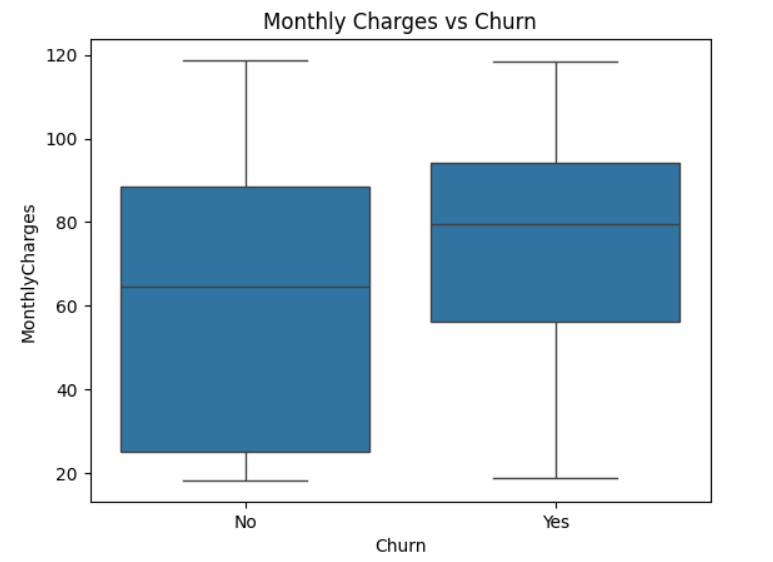
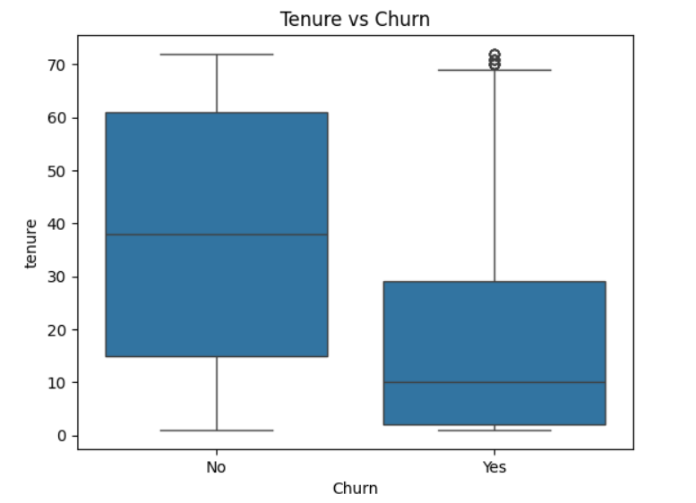

# 📊 Customer Churn Analysis

## 📌 Project Overview
Customer churn is a critical problem for businesses, especially in the telecom industry where acquiring new customers is more expensive than retaining existing ones.
This project analyzes customer churn data to identify key factors that lead customers to leave a company.

---

## 🎯 Business Objective
- Identify customers who are likely to churn
- Understand key drivers behind churn behavior
- Provide data-driven recommendations to improve customer retention

---

## 📂 Dataset Information
- Source: Telecom Customer Churn Dataset
- Records: ~7000 customers
- Features: Customer demographics, account information, services, billing details

---

## 🛠 Tools & Technologies
- Python
- Pandas & NumPy
- Matplotlib & Seaborn
- Jupyter Notebook / Google Colab

---

## 🔄 Project Workflow

1. Data Cleaning
- Handled missing values
- Converted data types (e.g., TotalCharges)
- Removed inconsistent records

2. Exploratory Data Analysis (EDA)
- Analyzed churn distribution
- Studied relationships between churn and key features
- Created visualizations for better understanding

3. Data Visualization
- Churn distribution
- Contract type vs churn
- Monthly charges vs churn
- Tenure vs churn

## 📂 Project Structure
customer-churn-analysis/ 
│ 
├── data/ # Dataset 
├── images/ # Visualizations 
├── notebooks/ # Jupyter Notebook 
├── churn_analysis.ipynb # Main analysis file 
└── README.md # Project documentation

---

## 📈 Visualizations

### 🔹 Churn charges

### 🔹 Churn Distribution

### 🔹 Churn by Contract Type

### 🔹 Tenure Churn 

---

## 💡 Key Insights
- Customers with month-to-month contracts have the highest churn rate
- Customers with higher monthly charges are more likely to churn
- Customers with short tenure (new customers) tend to leave early
- Long-term contract customers show better retention

---

## 💡 Business Recommendations
- Offer incentives for customers to switch to long-term contracts
- Provide discounts or loyalty benefits for high-paying customers
- Improve onboarding experience for new customers
- Target high-risk customers with retention campaigns

---

## 🎯 Conclusion
The analysis highlights key factors affecting customer churn and demonstrates how data analysis can help businesses improve retention strategies and customer satisfaction.

---

## 🚀 Future Improvements
- Build a churn prediction model using machine learning
- Create an interactive dashboard (Power BI / Tableau)
- Perform advanced segmentation analysis

---

## 👩‍💻 Author
Vidhya G  
Aspiring Data Analyst | SQL | Python | Power BI
