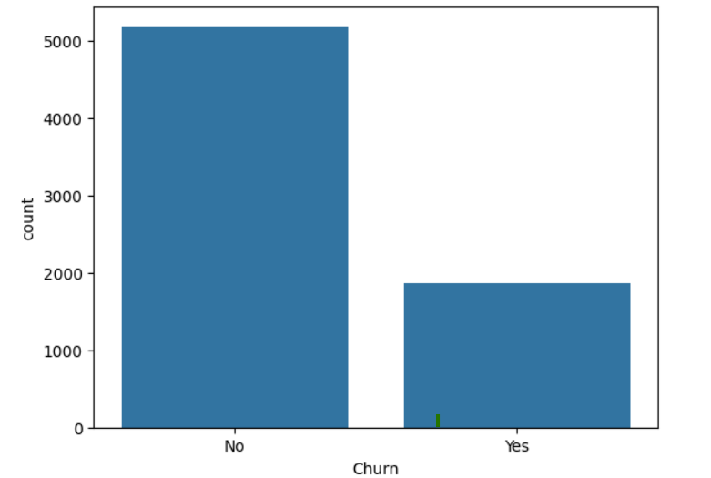
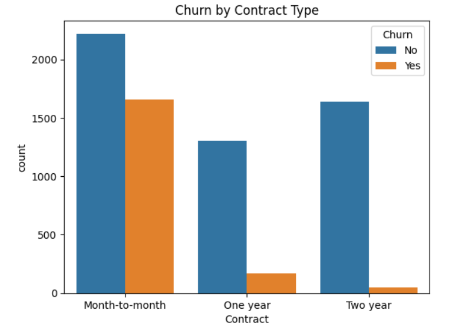

# 📊 Customer Churn Analysis

## 📌 Project Overview
This project analyzes customer churn data to identify key factors that influence customer retention. The analysis focuses on understanding customer behavior and uncovering patterns that lead to churn, helping businesses make data-driven decisions.

---

## 🛠️ Tools & Technologies Used
- Python (Pandas, NumPy)
- Data Visualization (Matplotlib)
- SQL (Basic querying and analysis)

---

## 📂 Project Structure
customer-churn-analysis/
│
├── data/
│ └── churn_data.csv
│
├── notebooks/
│ └── churn_analysis.ipynb
│
├── images/
│ ├── churn_distribution.png
│ └── contract_churn.png
│
├── README.md

---

## 🧹 Data Cleaning
- Removed missing and null values  
- Converted data types (e.g., TotalCharges to numeric)  
- Removed unnecessary columns (e.g., customerID)  
- Ensured data consistency for accurate analysis  

---

## 📊 Data Analysis Performed
- Analyzed overall churn distribution  
- Studied churn behavior based on contract type  
- Compared monthly charges between churned and retained customers  
- Identified patterns influencing customer retention  

---

## 📈 Visualizations

### 🔹 Churn Distribution

### 🔹 Churn by Contract Type

---

## 💡 Key Insights
- Customers with **month-to-month contracts** have a higher churn rate  
- Higher **monthly charges** are associated with increased churn  
- Customers with long-term contracts are more likely to stay  
- Contract type plays a significant role in customer retention  

---

## 🎯 Conclusion
The analysis highlights key factors affecting customer churn and demonstrates how data analysis can help businesses improve retention strategies and customer satisfaction.

---

## 🚀 Future Improvements
- Perform advanced analysis using SQL joins and window functions  
- Build an interactive dashboard using Power BI  
- Apply machine learning models to predict churn  

---

## 👩‍💻 Author
Vidhya G  
Aspiring Data Analyst | SQL | Python | Power BI
